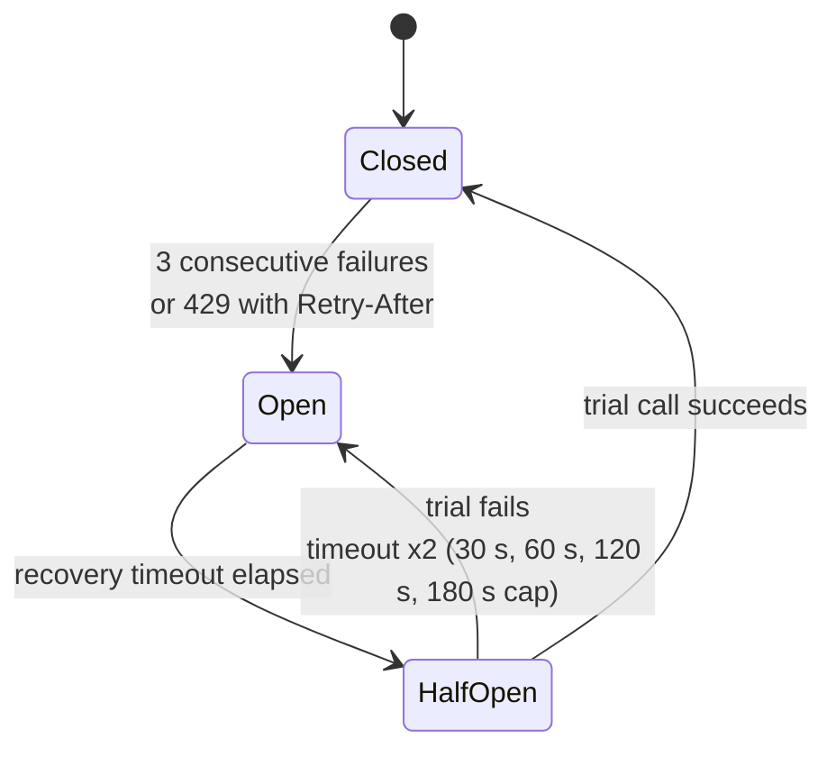

# tiered-llm

[](https://github.com/cir52/tiered-llm/actions/workflows/ci.yml)


[](LICENSE)

**The plumbing that lets an LLM system run unattended: per-provider circuit breakers, fallback chains, cheap-then-expensive cascades and an append-only decision log.** Works with Anthropic, Gemini, OpenAI, DeepSeek, OpenRouter, Ollama, llama.cpp and any OpenAI-compatible server. One runtime dependency (`httpx`).

```python
chain = FallbackChain([
    OpenRouterProvider("anthropic/claude-sonnet-4.5"),  # gateway first
    AnthropicProvider("claude-sonnet-4-5"),             # same model, direct API
    OllamaProvider("qwen3:14b"),                        # local, never rate-limited
])
response = await chain.complete(CompletionRequest.from_prompt("..."))
```

When the gateway rate-limits you at 3 a.m., the next request goes straight to the direct API. When that goes down too, its circuit opens after three failures and the local model answers, with nobody waiting on a dead API. A background monitor notices the recovery and traffic returns. Every step is written to a JSONL audit trail.

## Where it comes from

This library is extracted from **Trade52**, an AI trading platform I built solo between October 2025 and September 2026. It made consequential, irreversible decisions without a human in the loop and ran live on real capital for months. A local model on my own GPU screened every candidate; only the survivors reached a frontier model for the final call. Four interchangeable providers sat behind one interface, each with its own circuit breaker, and every decision went into an append-only log.

The trading logic stays private. This repository contains the part that generalises, rewritten as a standalone, tested library. It is the answer to the questions that stop most LLM pilots from reaching production:

| Question | Component |
|---|---|
| "What happens at 3 a.m. when the API rate-limits us?" | `CircuitBreaker` per provider, `FallbackChain`, `HealthMonitor` |
| "What will this cost per month in production?" | `Cascade`: the cheap model screens everything, the expensive one sees a fraction. `Pricing` puts a cost on every call |
| "What if the vendor changes pricing or deprecates the model?" | `Provider` interface, `Router.from_config`: swapping a vendor is a config change |
| "Can this run on-premise / keep data in-house?" | First-class `OllamaProvider` / `LlamaCppProvider`, GPU concurrency limit. Content logging is opt-in |
| "When it gets something wrong, can we find out why?" | `DecisionLog`: append-only, crash-tolerant JSONL of every call, skip, breaker transition and verdict |

## Install

```bash
pip install git+https://github.com/cir52/tiered-llm
```

Python 3.10+. API keys are read from the usual environment variables (`ANTHROPIC_API_KEY`, `GEMINI_API_KEY`, `OPENAI_API_KEY`, `DEEPSEEK_API_KEY`, `OPENROUTER_API_KEY`) or passed as `api_key=`.

## Quick start

### Fallback chain

```python
import asyncio
from tiered_llm import (AnthropicProvider, CompletionRequest, DecisionLog,
                        FallbackChain, GeminiProvider, OllamaProvider, Pricing)

async def main():
    log = DecisionLog("logs/decisions", rotate_daily=True)
    chain = FallbackChain(
        [
            AnthropicProvider("claude-sonnet-4-5", pricing=Pricing(3, 15)),
            GeminiProvider("gemini-2.5-flash", pricing=Pricing(0.3, 2.5)),
            OllamaProvider("qwen3:14b"),
        ],
        attempt_timeout=45,
        decision_log=log,
    )
    request = CompletionRequest.from_prompt(
        "Classify this contract clause ...",
        system="You are a paralegal.",
        json_mode=True,
        metadata={"request_id": "doc-4711"},   # goes to the log, never to the model
    )
    response = await chain.complete(request)
    print(response.provider, response.cost_usd, response.parse_json())
    print(response.attempts)  # which providers were tried, skipped or failed, and why

asyncio.run(main())
```

### Two-stage cascade: cheap screening, expensive judgement

```python
from tiered_llm import Cascade, CascadeItem, CascadeStats

cascade = Cascade(
    screen=FallbackChain([OllamaProvider("qwen3:8b")], name="screen"),
    decide=FallbackChain([AnthropicProvider("claude-sonnet-4-5", pricing=Pricing(3, 15))], name="decide"),
    gate=lambda screened: screened.parse_json()["escalate"],
    on_gate_error="escalate",    # small model returned garbage -> let the big one look
)

results = await cascade.run_many(
    [CascadeItem(screen=screen_request(t), decide=decide_request(t), item_id=t.id) for t in tickets],
    concurrency=8,
)
stats = CascadeStats.from_results(results)
print(f"{stats.escalation_rate:.0%} escalated, ${stats.total_cost_usd:.2f} total")
```

The same shape fits document triage, support-ticket routing, lead qualification and contract review: any workload with high volume where only a few items deserve a frontier model. `decide` can also be a function that builds the second request from the first model's answer.

### Per-task routing from config

```toml
# router.toml - API keys are never stored here; each provider reads its env var.
[breaker]
failure_threshold = 3
recovery_timeout = 30

[providers.local]
type = "ollama"
model = "qwen3:14b"

[providers.claude-proxy]
type = "openrouter"
model = "anthropic/claude-sonnet-4.5"
pricing = { input_per_mtok = 3.0, output_per_mtok = 15.0 }

[providers.claude-direct]
type = "anthropic"
model = "claude-sonnet-4-5"

[providers.gemini]
type = "gemini"
model = "gemini-2.5-flash"
breaker = { failure_threshold = 4, recovery_timeout = 15, max_recovery_timeout = 120 }

[routes]
screen = ["local", "gemini"]
decide = ["claude-proxy", "claude-direct", "gemini"]
```

```python
router = Router.from_config(tomllib.load(open("router.toml", "rb")), decision_log=log)
answer = await router.complete("decide", request)
```

All routes share **one breaker per provider**: if the `decide` task discovers that Gemini is down, the `screen` task stops sending it traffic too. A config that contains `api_key` is rejected, so it can be committed safely.

## Circuit breakers



- **One trial at a time.** While half-open, a single request (or health probe) tests the provider. Everything else keeps going to the fallback.
- **Exponential backoff.** A provider that stays down gets probed every few minutes, not on every request.
- **`Retry-After` is honoured.** A 429 that says when to come back opens the circuit for exactly that long (capped).
- **Stale results can't corrupt state.** Every call holds a `Permit` stamped with the breaker's generation. A slow success that arrives after the circuit has tripped cannot close it again.
- **Proactive recovery.** `router.health_monitor()` probes open circuits in the background with the cheapest check available (Ollama `/api/tags`, llama.cpp `/health`, otherwise a 1-token completion), so no real request has to pay for the experiment. A probe cancelled at shutdown hands its trial slot back.
- **Timeouts measure the provider, not your queue.** `attempt_timeout` starts when a request gets its concurrency slot, so eight requests queued for one local GPU aren't mistaken for an outage.
- **Thread-safe.** The defaults (3 failures, 30 s, x2, 180 s cap) are the production values of Trade52's primary provider. Every provider can override them.

### What counts as a failure

| Error | Examples | Next provider tried? | Counts against breaker? |
|---|---|---|---|
| `RateLimitError` | 429 | yes | yes; opens immediately if `Retry-After` is set |
| `ProviderUnavailableError` | timeout, connection refused, 5xx, 529 overloaded, 402 out of credits, 404 unknown model | yes | yes |
| `AuthenticationError` | 401, 403 | yes (the next provider has its own key) | yes |
| `ResponseParseError` | non-JSON body, blocked or empty candidates, gateway error inside a 200 | yes | yes |
| `InvalidRequestError` | 400, 413, 422 | **no**, re-raised at once | **no**: the request is at fault, not the provider |

Vendor quirks are mapped per provider: Anthropic reports an empty credit balance as a 400 (treated as unavailable), Gemini reports an invalid key as a 400 (treated as an authentication error), and a Gemini answer blocked by safety filters is a `ResponseParseError`, not an empty success.
| any other exception | a bug in your code | no, propagates unchanged | no |

## Decision log

```jsonl
{"ts": "2026-09-23T11:13:52.463+00:00", "event": "llm_call", "chain": "decide", "provider": "claude", "position": 0, "outcome": "error", "latency_ms": 45012.3, "error": "ProviderUnavailableError: timed out after 45s", "meta": {"request_id": "doc-4711"}}
{"ts": "2026-09-23T11:13:52.665+00:00", "event": "breaker_transition", "provider": "claude", "old": "closed", "new": "open", "consecutive_failures": 3, "recovery_attempts": 0, "retry_after": 30.0}
{"ts": "2026-09-23T11:13:52.766+00:00", "event": "llm_call", "chain": "decide", "provider": "claude", "position": 0, "outcome": "skipped", "error": "circuit open, retry in 29.9s", "meta": {"request_id": "doc-4712"}}
{"ts": "2026-09-23T11:13:53.981+00:00", "event": "llm_call", "chain": "decide", "provider": "gemini", "position": 1, "outcome": "ok", "latency_ms": 1180.4, "input_tokens": 812, "output_tokens": 164, "cost_usd": 0.000654, "meta": {"request_id": "doc-4712"}}
```

The logger keeps the durability rules of the production version:

- Buffered: written when 50 events are pending, every 5 s by a small background thread, and immediately for breaker transitions. Each write is one unbuffered append plus `fsync`.
- A line cut off by a crash is closed with a newline before the next append, so it can't glue onto (and corrupt) the next event. `iter_decisions()` skips such fragments.
- If a write fails halfway (disk full), the file is truncated back to where it was and the batch stays queued (bounded), so events are neither lost nor doubled. An event that can't be serialised is dropped instead of being retried forever. After a successful write, a failed `fsync` is *not* retried, because that would duplicate events.
- One writer process per file; any number of threads.
- `NaN`/`inf` become `null`. Bare `NaN` is valid for Python and invalid for most other JSON readers.
- Prompts and responses are **not** logged unless `log_content=True`. The default trail contains metadata, tokens, cost and outcomes only, which is usually what a GDPR review wants to hear.
- `log.health()` reports buffered/written/dropped counts and the last error, ready for a health endpoint.

## Providers

| Class | Endpoint | Notes |
|---|---|---|
| `AnthropicProvider` | Messages API | |
| `GeminiProvider` | `generateContent` | thinking parts are stripped; thinking tokens are billed as output |
| `OpenAIProvider` | Chat Completions | uses `max_completion_tokens` |
| `DeepSeekProvider` | OpenAI-compatible | |
| `OpenRouterProvider` | OpenAI-compatible | `app_name` / `app_url` attribution headers; detects upstream errors wrapped in HTTP 200 |
| `OllamaProvider` | `/api/chat` | `max_concurrency=1` by default so parallel calls don't make runners fight over one GPU's VRAM; `keep_alive`; `choose_model()` resolves a preference list against pulled models |
| `LlamaCppProvider` | `llama-server` | health via `/health` ("no slot available" means busy, not down) |
| `OpenAICompatibleProvider` | any `/chat/completions` | vLLM, LM Studio, TGI, ... |

Adding one means subclassing `Provider` and implementing `_complete()`: concurrency limits, latency, cost and breaker handling come for free. `response.parse_json()` recovers JSON from Markdown fences, surrounding prose, `<think>` blocks (DeepSeek-R1, Qwen3) and the Python-literal output small local models like to produce.

## Health endpoint

```python
@app.get("/health/llm")
def llm_health():
    return {"providers": router.status(), "decision_log": log.health()}
```

```json
{"providers": {"claude-proxy": {"state": "open", "consecutive_failures": 3, "recovery_attempts": 1, "retry_after": 41.7, "total_successes": 1822, "total_failures": 9}, "...": {}},
 "decision_log": {"buffered": 3, "written": 48211, "dropped": 0, "write_failures": 0, "last_error": null}}
```

## Try it offline

Both demos use scripted providers and need no API keys.

```bash
python examples/outage_drill.py     # primary goes down mid-stream, circuit opens, recovers
python examples/ticket_triage.py    # two-stage cascade with cost comparison (--live for Ollama + Claude)
```

```
#05  claude ok                   closed
---  claude goes down  ---
#06  claude FAIL -> gemini ok    closed
#07  claude FAIL -> gemini ok    closed
#08  claude FAIL -> gemini ok    open
#09  claude SKIP -> gemini ok    open
...
---  claude recovers   ---
#26  claude ok                   closed
```

`tiered_llm.testing.ScriptedProvider` is public, so you can run the same kind of chaos drill against your own routing in your test suite.

## Lessons carried over from production

The in-app version inside Trade52 worked, but extracting it made some weaknesses obvious. This library fixes them:

1. **One breaker, not one per provider class.** The original breaker was copy-pasted into each provider class, and the copies had drifted apart. In one, a late failure while open restarted the timer; the other ignored it. One cleared its "health check in progress" flag, the other never did. The DeepSeek provider had no breaker at all. There is now one implementation with one set of semantics, and it is tested.
2. **Typed exceptions instead of error dictionaries.** The providers caught every exception and returned `{"action": "ERROR", ...}`. As a result, the retry decorator wrapped around them never saw a failure and never retried. Now the exception type alone decides between fallback, retry and re-raise.
3. **Generations on permits.** Slow calls that return after a state change can no longer flip the breaker.
4. **Event-loop awareness.** Trade52's local-GPU semaphore needed two fixes before it behaved across threads and event loops. Here both the concurrency limiter and the owned HTTP clients are kept per running loop, so one provider object works from successive `asyncio.run()` calls and worker threads.
5. **The decision log's durability rules** (listed above) are carried over unchanged from the production logger.

## Scope

Small and meant to be read: about 1,500 statements of library code, `mypy --strict` clean, and a test suite that runs offline in under two seconds. Not included: streaming, tool calling, prompt templating and embeddings. If you need a hundred providers behind one API, use LiteLLM. If you want resilience you can read in an afternoon and adapt, this is for you.

## Development

```bash
pip install -e ".[dev]"
pytest              # 103 tests, no network
ruff check . && ruff format --check .
mypy                # strict
```

## License

MIT. Built by [Ronald Neubert](https://ronaldneubert.vercel.app), AI / LLM Systems Engineer. The [Trade52 case study](https://ronaldneubert.vercel.app) covers the system this came from.
